# Komunikasi Data dan Jaringan Komputer &mdash; Modul 1

## Table of Contents

-   [1. 1 Router \& 2 Switches \& 4 Clients](#1-1-router--2-switches--4-clients)
-   [2. Menghubungkan Router ke Internet](#2-menghubungkan-router-ke-internet)
-   [3. Menghubungkan tiap Client dengan satu sama lain](#3-menghubungkan-tiap-client-dengan-satu-sama-lain)
-   [4. Menghubungkan tiap Client dengan internet](#4-menghubungkan-tiap-client-dengan-internet)
-   [5. Membuat Konfigurasi Node tidak hilang ketika Restart](#5-membuat-konfigurasi-node-tidak-hilang-ketika-restart)
-   [6. Packet Sniffing Koneksi Manwe dengan Eru](#6-packet-sniffing-koneksi-manwe-dengan-eru)
-   [7. FTP Server \& 2 New User Permissions](#7-ftp-server--2-new-user-permissions)
-   [8. Analisis Proses Upload File \& Identifikasi Perintah FTP](#8-analisis-proses-upload-file--identifikasi-perintah-ftp)
-   [9. Akses Pengguna FTP](#9-akses-pengguna-ftp)
    -   [9.1 Download File](#91-download-file)
    -   [9.2 Memindahkan File ke Dalam FTP](#92-memindahkan-file-ke-dalam-ftp)
    -   [9.3 Melakukan konfigurasi akses pengguna](#93-melakukan-konfigurasi-akses-pengguna)
    -   [9.4 Uji Akses Pengguna](#94-uji-akses-pengguna)
-   [10. Identifikasi Packet Loss \& Average Round Trip Time](#10-identifikasi-packet-loss--average-round-trip-time)
    -   [10.1 Ping Spam](#101-ping-spam)
    -   [10.2 Ping Flood](#102-ping-flood)
-   [11. Identifikasi Kelemahan Telnet Protokol](#11-identifikasi-kelemahan-telnet-protokol)
-   [12. Scan Port Netcat](#12-scan-port-netcat)
-   [12.1 Setup Port](#121-setup-port)
-   [12.2 Netcat](#122-netcat)
-   [13. Identifikasi Keunggulan Secure Shell](#13-identifikasi-keunggulan-secure-shell)
-   [14. Identifikasi Brute Force](#14-identifikasi-brute-force)
    -   [14.1 Jumlah Packets](#141-jumlah-packets)
    -   [14.2 User Login (HTTP)](#142-user-login-http)
    -   [14.3 Stream ID](#143-stream-id)
    -   [14.4 Identifikasi Tools](#144-identifikasi-tools)
-   [15. Identifikasi Device \& Keystrokes](#15-identifikasi-device--keystrokes)
    -   [15.1 Identifikasi Device](#151-identifikasi-device)
    -   [15.2 Mengumpulkan Input](#152-mengumpulkan-input)
    -   [15.3 Pesan Rahasia](#153-pesan-rahasia)

## 1. 1 Router & 2 Switches & 4 Clients

**Goal:** Menghubungkan 1 Router dengan 2 Switches/Gateways, dimana tiap switch akan terhubung dengan 2 Client

-   **Components:**
    -   Router: Eru
    -   Switch1
    -   Switch2
    -   Client1: Melkor
    -   Client2: Manwe
    -   Client3: Varda
    -   Client4: Ulmo

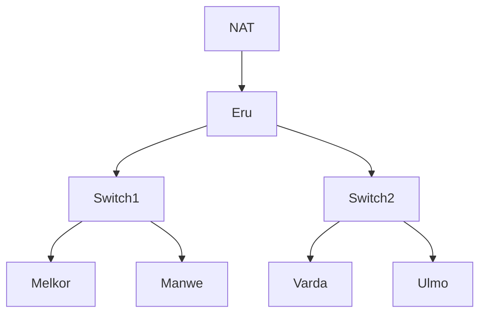

### 1.1 Topology Image

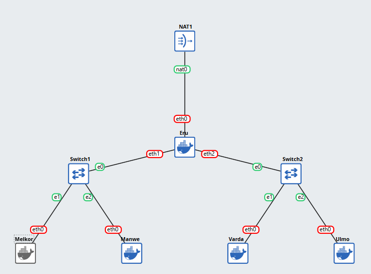

### 1.2 Topology Details

-   **NAT1:** Network Address Translation (NAT) merupakan jembatan yang ada antara local IP Address dengan Public IP Address. Hasil dari penggunaan NAT adalah dengan adanya suatu device/Client dari Local Network yang ingin mengakses internet (global), maka IP Address yang akan digunakan adalah Public IP Address yang dimiliki NAT tersebut.
-   **Eru:** Router merupakan alat jaringan pada OSI Layer 3, dimana berfungsi untuk menghubungkan berbagai jaringan lokal yang berbeda, baik dengan satu sama lain maupun menuju ke suatu hubungan lainnya, seperti internet. Cara kerjanya adalah dengan menggunakan Routing Table untuk mencari IP Address tujuan.
-   **Switch1/2:** Switch merupakan alat jaringan pada OSI Layer 2, dimana berfungsi untuk menghubungkan jaringan antara satu device dengan device yang lainnya yang berada di dalam satu cakupan jaringan lokal yang sama. Cara kerjanya adalah dengan menggunakan MAC Address Table untuk mencari MAC Address dari suatu device tujuan. Switch bekerja dengan meneruskan jaringan secara langsung dari satu device menuju device lainnya tanpa melalui device lainnya, sehingga traffic activity tidak akan terlihat oleh device lainnya yang berada dalam satu cakupan LAN.
-   **Melkor/Manwe/Varda/Ulmo:** Client merupakan alat jaringan yang menginisiasi permintaan layanan jaringan menuju alat jaringan lainnya.

## 2. Menghubungkan Router ke Internet

**Goal:** Menyambungkan Eru dengan internet.

### 2.1 Router Network Configuration

```shell
auto eth0
iface eth0 inet dhcp
```

-   `auto eth0`: Secara otomatis, ketika jaringan pertama berjalan/menyala, maka akan mencari antarmuka jaringan `eth0` dan memastikan untuk menyalakan kartu jaringan tersebut.
-   `iface eth0 inet dhcp`: baris berikut digunakan untuk mengonfigurasi kartu jaringan `eth0`.
    -   `iface eth0`: Menyatakan secara eksplisit bahwa mengonfigurasi `eth0` interface.
    -   `inet`: Menyatakan bahwa configurasi dilakukan dengan jaringan IPv4 (kalau `inet6` merupakan IPv6).
    -   `dhcp`: Dibandingkan `static` (dimana diharuskan untuk mengonfigurasi IP address secara manual), `dhcp` meminta antarmukanya untuk secara aktif meminta konfigurasi jaringan kepada server pada jaringan melalui DHCP Client.

## 3. Menghubungkan tiap Client dengan satu sama lain

**Goal:** Menghubungkan Melkor, Manwe, Varda, dan Ulmo antara satu sama lain.

### 3.1 Switches Gateways

Tiap client dapat dihubungkan melalui switch, sehingga tiap switch menjadi suatu jaringan lokal tersendiri seperti gambar di bawah ini.

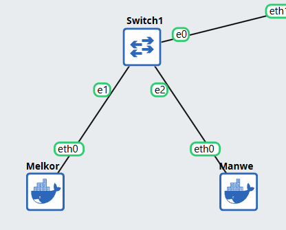

Hal ini dapat bekerja dengan tiap Client memiliki konfigurasi sebagai berikut:

**1. Melkor**

```shell
auto eth0
iface eth0 inet static
	address 10.72.1.2
	netmask 255.255.255.0
	gateway 10.72.1.1
```

**2. Manwe**

```shell
auto eth0
iface eth0 inet static
	address 10.72.1.3
	netmask 255.255.255.0
	gateway 10.72.1.1
```

**3. Varda**

```shell
auto eth0
iface eth0 inet static
	address 10.72.2.2
	netmask 255.255.255.0
	gateway 10.72.2.1
```

**4. Ulmo**

```shell
auto eth0
iface eth0 inet static
	address 10.72.2.3
	netmask 255.255.255.0
	gateway 10.72.2.1
```

### 3.2 Router Gateways

Lalu untuk Router sendiri harus memiliki konfigurasi sebagai berikut sehingga dapat menghubungkan kedua jaringan lokal yang berbeda dari keda switch:

```shell
auto eth0
iface eth0 inet dhcp

auto eth1
iface eth1 inet static
	address 10.72.1.1
	netmask 255.255.255.0

auto eth2
iface eth2 inet static
	address 10.72.2.1
	netmask 255.255.255.0
```

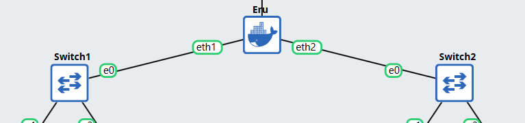

## 4. Menghubungkan tiap Client dengan internet

**Goal:** Menyambungkan Melkor, Manwe, Varda, dan Ulmo dengan internet.

### 4.1 Router Configuration

Untuk membuat tiap tiap client dapat terhubung ke internet harus dilakukannya konfigurasi pada router, `Eru`, yang terhubung secara langsung dengan `NAT1`. Hal ini dikarenakan semua request dari client akan melalui `Eru` dan juga akan diteruskan ke internet melalui `Eru` menuju `NAT1`. Konfigurasi yang dilakukan pada `Eru` adalah konfigurasi iptables, yaitu routing table yang dimiliki `Eru`, sehingga diperbolehkannya request dan diteruskan request tersebut menuju internet. Konfigurasi yang ditambahkan dapat dilihat di bawah berikut.

```shell
auto eth0
iface eth0 inet dhcp
        up apt update && apt install iptables -y
        up iptables -t nat -A POSTROUTING -o eth0 -j MASQUERADE -s 10.72.0.0/16

auto eth1
iface eth1 inet static
	address 10.72.1.1
	netmask 255.255.255.0

auto eth2
iface eth2 inet static
	address 10.72.2.1
	netmask 255.255.255.0
```

## 5. Membuat Konfigurasi Node tidak hilang ketika Restart

**Goal:** Mengonfigurasi tiap Node (Router dan Client) sehingga ketika di-restart konfigurasi tidak akan terulang.

### 5.1 Preliminary

Untuk tiap Node dari network dapat menjaga konfigurasi yang dimiliki tidak ter-restart ulang ketika di-restart dapat dilakukan 3 metode, yaitu:

1. memberikan konfigurasi melalui GNS3 sendiri (Network Configuration)
2. /root
3. /root/.bashrc

### 5.2 Network Configuration

Agar konfigurasi tiap node tidak terulang terus-menerus ketika di-restart, kami lebih memilih untuk memanfaatkan Network Configuration pada tiap node. Hal ini dapat dilihat pada berikut:

**1. Eru:**

```shell
auto eth0
iface eth0 inet dhcp
        up apt update && apt install iptables -y
        up iptables -t nat -A POSTROUTING -o eth0 -j MASQUERADE -s 10.72.0.0/16

auto eth1
iface eth1 inet static
	address 10.72.1.1
	netmask 255.255.255.0

auto eth2
iface eth2 inet static
	address 10.72.2.1
	netmask 255.255.255.0
```

**2. Client:**

```shell
auto eth0
iface eth0 inet static
	address 10.72.x.x
	netmask 255.255.255.0
	gateway 10.72.x.x
        up echo nameserver 192.168.122.1 > /etc/resolv.conf
        up apt-get update && apt-get install ftp -y
```

## 6. Packet Sniffing Koneksi Manwe dengan Eru

**Goal:** Melakukan _packet sniffing_ terhadap traffic yang terbuat antara Manwe dengan Eru.

> -   **Notes:** Mencantumkan hasil _capture_ yang merupakan hasil _packet sniffing_ dengan _display filter_ untuk menampilkan semua paket yang berasal dari atau menuju ke **IP Address Manwe**.
> -   **Artifacts:** [traffic.zip](https://drive.google.com/drive/folders/1ULr_Fik1O0_79zUng41POMZtdzJTugVR?usp=sharing)

### 6.1 Original Capture

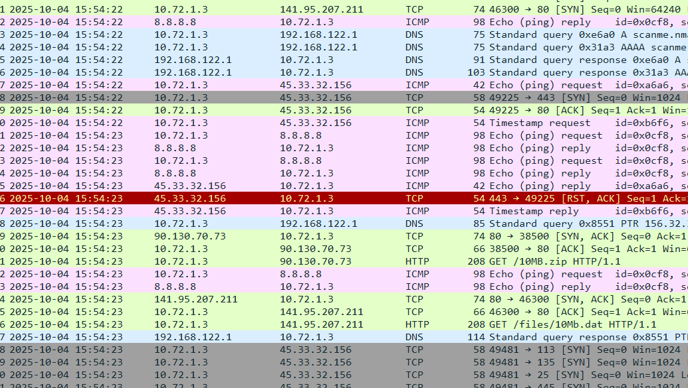

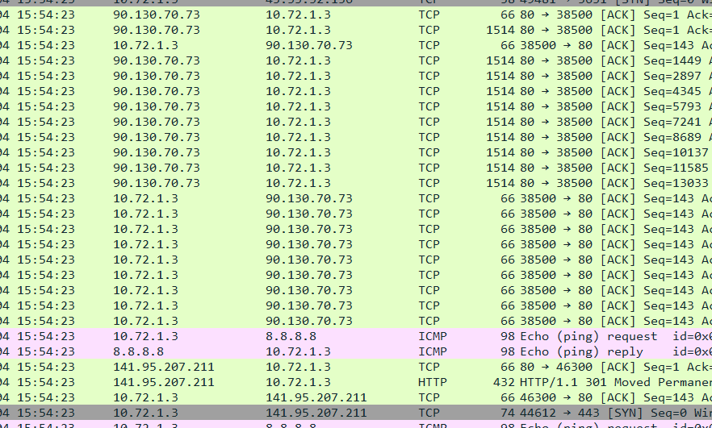

### 6.2 Display

Filter using ip.addr == 10.72.1.3

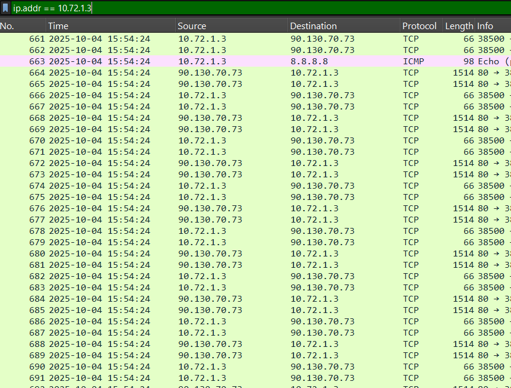

[Link to capture file](https://drive.google.com/file/d/1LDJq-uvVa-4_Hed7k-uppJYQItqfuVWy/view?usp=sharing)

## 7. FTP Server & 2 New User Permissions

**Goal:** Membuat suatu FTP Server dengan dua user baru dimana ainur memiliki _write & read permission_ dan melkor tidak memiliki permission sama sekali.

> -   **Notes:** Melakukan testing dengan file teks sederhana yang diuji dengan diakses oleh kedua user baru.

### 7.1 FTP Script

Pertama-tama menggunakan script berikut agar bisa melakukan setup FTP server besertakan kedua user: ainur (read & write) dan melkor (tidak ada permission sama sekali).

```shell
echo "Updating package list and installing vsftpd..."
apt-get update -qq > /dev/null 2>&1
apt-get install -qq -y vsftpd > /dev/null 2>&1

echo "Creating shared FTP directory and a test file..."
mkdir -p /srv/ftp
chown ftp:ftp /srv/ftp
chmod 777 /srv/ftp
echo "This is a test file on the server." > /srv/ftp/serverfile.txt

AINUR_PASS="ainur"
MELKOR_PASS="melkor"

echo "Creating user 'ainur' and 'melkor'..."
useradd -m ainur
useradd -m melkor

echo "Setting passwords for users..."
echo "ainur:$AINUR_PASS" | chpasswd
echo "melkor:$MELKOR_PASS" | chpasswd

echo "Configuring vsftpd..."

cat > /etc/vsftpd.conf <<EOF
listen=YES
listen_ipv6=NO
anonymous_enable=NO
local_enable=YES
write_enable=YES
dirmessage_enable=YES
use_localtime=YES
xferlog_enable=YES
connect_from_port_20=YES
chroot_local_user=YES
secure_chroot_dir=/var/run/vsftpd/empty
pam_service_name=vsftpd
rsa_cert_file=/etc/ssl/certs/ssl-cert-snakeoil.pem
rsa_private_key_file=/etc/ssl/private/ssl-cert-snakeoil.key
ssl_enable=NO
allow_writeable_chroot=YES

# Custom settings
local_root=/srv/ftp
userlist_enable=YES
userlist_file=/etc/vsftpd.userlist
userlist_deny=YES
EOF


echo "Blocking user 'melkor'..."
echo "melkor" > /etc/vsftpd.userlist

echo "Restarting FTP server to apply all changes..."
service vsftpd restart

echo ""
echo "FTP Server setup is complete!"
echo "  - User 'ainur' has read/write access (Password: $AINUR_PASS)"
echo "  - User 'melkor' is blocked from logging in (Password: $MELKOR_PASS)"
echo "  - The shared directory is /srv/ftp"
```

Hal ini ditambahkan pada `/root` sehingga dapat dijalankan dengan mudah karena tidak hilang ketika direstart. Lalu ketika dijalankan akan sudah terbuat FTP server dan kedua user tersebut.

### 7.2 FTP Server Result

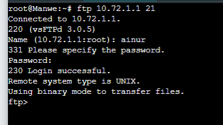
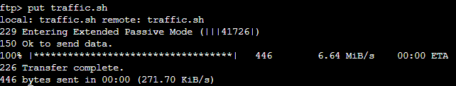
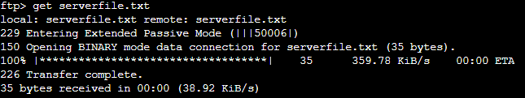
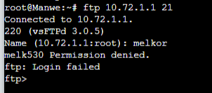

## 8. Analisis Proses Upload File & Identifikasi Perintah FTP

**Goal:** Menggunakan user _ainur_ untuk upload dari _Ulmo_ untuk upload file ke _Eru_ dan menganalisis proses dan mengidentifikasi perintah FTP yang terjadi menggunakan Wireshark.

> -   **Artifacts:** [cuaca.zip](https://drive.google.com/drive/folders/1XQh6S1xXcaP1QoUhQSZORsgK9xdMUxXx?usp=sharing)

### 8.1 Package Installation

Pertama-tama melakukan instalasi package yang ingin di-transfer, seperti berikut: 

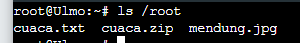

### 8.2 Wireshark Analysis

Berikut merupakan hasil dari upload.

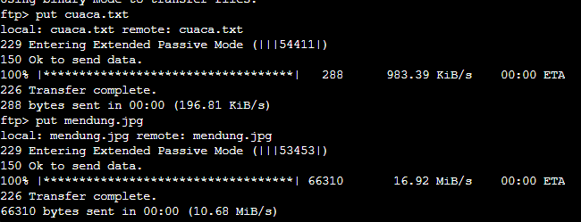

Dan dapat dilihat dari berikut bahwa protokol yang digunakan untuk menginisiasi upload adalah dengan protokol FTP. Sementara itu, untuk memindahkan data menggunakan FTP-DATA, dan jika cara terlalu besar untuk satu packet, maka proses transfer akan dibagi menjadi lebih dari satu packet.

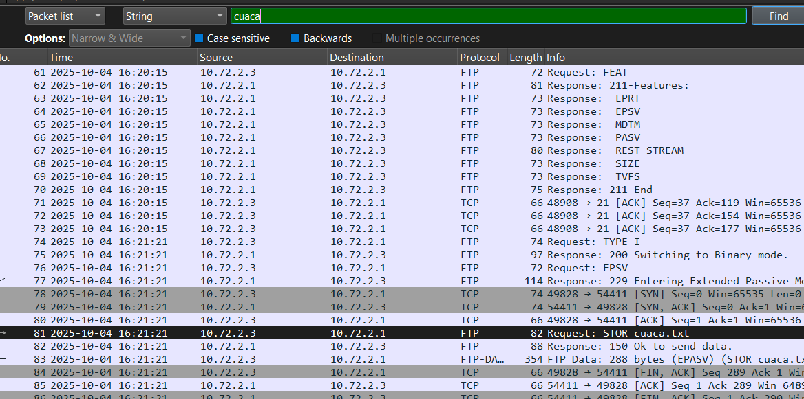

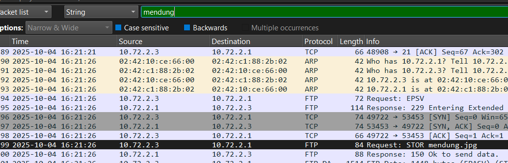

## 9. Akses Pengguna FTP

**Goal:** Membagikan file "Kitab Penciptaan" sebagai _Eru_ serta memastikan node _Manwe_ dapat mengunduh file tersebut dan membatasi akun pengguna _ainur_ menjadi _read-only_.

### 9.1 Download File

Langkah pertama sebelum membagikan file "Kitab Penciptaan" melalui **Eru**, kita perlu mengunduh file melalui Google drive. Buka node **Eru** dan jalankan command berikut:

```shell
wget --no-check-certificate 'https://drive.google.com/uc?export=download&id=11ua2KgBu3MnHEIjhBnzqqv2RMEiJsILY' -O kitab_penciptaan.zip
```

Karena file yang di _download_ merupakan `.zip`, maka kita perlu mengekstraknya untuk mendapatkan file `.txt`

Instal `unzip` untuk membantu mengekstrak file:

```bash
apt install unzip
unzip kitab_penciptaan.zip
```

### 9.2 Memindahkan File ke Dalam FTP

Setelah selesai mengekstak file, kita perlu memindah file tersebut ke dalam direktori FTP server supaya dapat diakses node lain melalui FTP

```bash
mv kitab_penciptaan.txt /srv/ftp/
```

### 9.3 Melakukan konfigurasi akses pengguna

Karena kita ingin membagikan file ini ke node **Manwe** dengan memastikan bahwa user **ainur** hanya memiliki akses _read-only_, kita perlu menambahkan file konfigurasi akses pengguna.

```bash
echo “user_config_dir=/etc/vsftpd_user_conf” > /etc/vsftpd.conf
mkdir /etc/vsftpd_user_conf
```

Setelah folder konfigurasi pengguna sudah ditambahkan ke konfigurasi umum, kita dapat menambahkan file konfigurasi pengguna ke dalam folder tersebut.

Konfigurasi **Manwe**

```
echo “write_enable=YES” > /etc/vsftpd_user_conf/manwe
```

Konfigurasi **ainur**

```
echo “write_enable=NO” > /etc/vsftpd_user_conf/ainur
```

Setelah selesai menambahkan konfigurasi, kita bisa melakukan *restart* pada *service* `vsftpd`:
```
service vsftpd restart
```

### 9.4 Uji Akses Pengguna

Pada node **Manwe**, kita seharusnya dapat megunduh, mengunggah, dan menghapus file melalui FTP dengan kredensial

```
Name : manwe
Password: manwe
```

Jalankan perintah FTP dan masukkan kredensial yang telah disediakan.

```
ftp 10.72.1.1
```

Uji akses pengguna dengan mengunduh file dan mengunggah file

```
ftp> get kitab_penciptaan.txt
ftp> put coba.txt
```

Jika konfigurasi sudah benar, maka kedua perintah tersebut akan berhasil dijalankan.

Kemudian, pada node yang sama, kita akan menguji akses pengguna **ainur** dengan kredensial

```
Name: ainur
Password: ainur
```

Lakukan perintah FTP yang sama dengan kredensial **ainur** dan jika konfigurasi sudah benar, maka pengguna **ainur** hanya dapat mengunduh file tetapi tidak dapat mengunggah file dengan respon `550 Permission denied.`

> -   **Artifacts:** [kitab_penciptaan.zip](https://drive.google.com/drive/folders/1XQh6S1xXcaP1QoUhQSZORsgK9xdMUxXx?usp=sharing)

## 10. Identifikasi Packet Loss & Average Round Trip Time

**Goal:** Melakukan spam ping ke node _Eru_ menggunakan sebagai _Melkor_ dan mengidentifikasi dampak dari ping.

### 10.1 Ping Spam

Kita akan mengirimkan ping dengan jumlah 100 paket ke node **Eru** melalui node **Melkor**
Kita dapat menggunakan command berikut:

```
ping -c 100 10.72.1.1
```

atau

```
ping -f -c 100 10.72.1.1
```

Setelah itu, kita akan mendapatkan detail terkait persentase packet loss dan average round trip time


Di sini kita dapat melihat bahwa dengan membatasi jumlah ping sebanyak 100 paket, dampak yang terjadi pada _average round trip time_ dan jumlah persentase _packet loss_ tidak begitu signifikan.

### 10.2 Ping Flood

Namun, jika kita menghilangkan batas tersebut. Dampaknya pada _average round trip time_ dan jumlah persentase _packet loss_ akan sedikit lebih terlihat.


## 11. Identifikasi Kelemahan Telnet Protokol

**Goal:** Buat akun baru di node _Melkor_ dan tangkap sesi login _Eru_ menggunakan Wireshark.

## 12. Scan Port Netcat

**Goal:** Melakukan pemindaian port dari node _Eru_ ke node _Melkor_ menggunakan **Netcat** `nc` untuk memeriksa port 21, 80 dalam keadaan terbuka dan port 666 dalam keadaan tertutup.

## 12.1 Setup Port

Pada node **Melkor**, jalankan FTP dan apache untuk membuka port 21 dan 80

FTP

```
apt-get install vsftpd -y
service vsftpd start
```

Apache

```
apt-get install apache2 -y
service apache2 start
```

## 12.2 Netcat

Pada node **Eru** lakukan netcat ke IP **Melkor** dengan port yang sudah ditentukan (21, 80, 666)

```
nc -zv 10.72.1.2 21 60 666
```

Jika berhasil, output yang diberikan akan terlihat seperti ini:

```
Connection to 10.72.1.2 21 port [tcp/ftp] succeeded!
Connection to 10.72.1.2 80 port [tcp/http] succeeded!
nc: connect to 10.72.1.2 port 666 (tcp) failed: Connection refused
```

## 13. Identifikasi Keunggulan Secure Shell

**Goal:** Melakukan koneksi SSH dari node _Varda_ ke _Eru_ dan menganalisis perbedaan `telnet` dengan SSH.

## 14. Identifikasi Brute Force

**Goal:** Mengidentifikasi serangan brute force melalui HTTP request melalui Wireshark.

### 14.1 Jumlah Packets

**_Q: How many packets are recorded in the pcapng file?_**

Pada tampilan Wireshark di bagian bawah terdapat semacam _footer_ yang mencantumkan nama file jumlah _packets_ dan profile yang dipakai. Dari tampilan tersebut kita bisa mengetahui jumlah _packets_ yang ada pada file yang sedang kita buka.


Dari tampilan ini kita menemukan bahwa terdapat sebanyak `500358` _packets_

### 14.2 User Login (HTTP)

**_Q: What are the user that successfully logged in?_**

Jika dilihat sekilas, kita tahu bahwa pada file ini terdapat jejak yang menunjukkan beberapa kali percobaan login melalui HTTP request. Kita akan menggunakan filter `http.response.code == 200` untuk mengambil request yang berhasil diproses saja.


Dari hasil filter, kita menemukan respons yang menunjukkan "Invalid credentials" yang berarti request login berhasil diproses.

Selanjutnya, kita perlu mengeleminasi login yang gagal untuk menemukan respon login yang berhasil. Kita akan menggunakan filter `http contains "Invalid credentials"` dan kemudian menandai seluruh respons gagal login dengan _select all_ `ctrl + a` dan _shortcut_ `ctrl + m` untuk _mark_. Setelah itu, kita bisa kembali ke filter `http.response.code == 200` dan menemukan respons yang tidak tertandai.


Setelah itu kita bisa klik kanan pada _packet_ tersebut dan memilih `follow > HTTP Stream` untuk mendapatkan detail request yang bersangkutan dengan respons tersebut.


Dari tampilan ini kita menemukan kredensial pengguna yang berhasil digunakan untuk login, yaitu:

```
n1enna:y4v4nn4_k3m3nt4r1
```

### 14.3 Stream ID

**_Q: In which stream were the credentials found?_**

Pada tampilan `HTTP Stream` sebelumnya, kita dapat melihat ID stream pada bagian atas (header).


Tampilan tersebut menunjukkan bahwa kredensial pengguna yang digunakan untuk login ada pada stream `41824`.

### 14.4 Identifikasi Tools

**_Q: What tools are used for brute force?_**

Karena brute force dilakukan melalui protokol HTTP, maka tools yang digunakan dapat kita lihat pada tampilan `HTTP Stream` yang sama pada bagian `User-Agent` di dalam barisan request.


Melalui tampilan tersebut, kita dapat mengetahui bahwa tools yang digunakan oleh penyerang adalah `Fuzz Faster U Fool v2.1.0-dev`.

> -   flag: KOMJAR25{Brut3_F0rc3_GYJfoNyTGpfHDDqiVrB7bXs9G}

## 15. Identifikasi Device & Keystrokes

**Goal:** Mengidentifikasi device yang digunakan penyerang dan melakukan decode pada input keystrokes yang ditemukan

### 15.1 Identifikasi Device

**_Q: What device does Melkor use?_**

Pada file ini, untuk dapat mengetahui device yang digunakan. Kita bisa menggunakan filter `usb.binterfaceProtocol` yang berisikan informasi terkait protocol yang digunakan, misalnya seperti mouse, keyboard, joystick, dan lain-lain


Pada tampilan tersebut, kita mendapatkan informasi bahwa device yang digunakan adalah `Keyboard`.

### 15.2 Mengumpulkan Input

**_Q: What did Melkor write?_**

Pada kasus ini, Kita dapat menggunakan filter `usb.transfer_type == 0x01` ketika pengguna menggunakan perangkat berupa keyboard yang termasuk perangkat yang menggunakan tipe transfer `interrupt`.


Pada beberapa paket, ditemukan `HID Data` yang merupakan input dengan suatu format tertentu.

```
HID Data: 0200000000000000
    .... ...0 = Key: LeftControl (0xe0): UP
    .... ..1. = Key: LeftShift (0xe1): DOWN
    .... .0.. = Key: LeftAlt (0xe2): UP
    .... 0... = Key: LeftGUI (0xe3): UP
    ...0 .... = Key: RightControl (0xe4): UP
    ..0. .... = Key: RightShift (0xe5): UP
    .0.. .... = Key: RightAlt (0xe6): UP
    0... .... = Key: RightGUI (0xe7): UP
    Padding: 00
```

Dari pengamatan yang dilakukan, kita mengetahui bahwa 2 bit pertama merupakan _modifier keys_. Dari 2 bit pertama tersebut, kita bisa mengetahui input spesifik yang dilakukan. Sedangkan, 2 bit berikutnya merupakan padding.

```
Array: 1c0000000000
    0001 1100 = Usage: Keyboard y and Y (0x0007, 0x001c)
    0000 0000 = Usage: Reserved (no event indicated) (0x0007, 0x0000)
    0000 0000 = Usage: Reserved (no event indicated) (0x0007, 0x0000)
    0000 0000 = Usage: Reserved (no event indicated) (0x0007, 0x0000)
    0000 0000 = Usage: Reserved (no event indicated) (0x0007, 0x0000)
    0000 0000 = Usage: Reserved (no event indicated) (0x0007, 0x0000)
```

Beberapa bit berikutnya mengandung _slots_ untuk _non-modifier keys_ seperti huruf dan angka. Mengetahui hal ini, kita bisa menambahkan data ini ke dalam kolom untuk kita export sebagai [keystrokes.csv](resources/keystrokes.csv) untuk memudahkan kita mengambil data yang diperlukan nantinya.

Karena terlalu merepotkan jika harus mengecek satu per satu HID Data dan mengubahnya ke dalam bentuk ASCII, maka saya membuat kode untuk menerjemahkannya secara otomatis menggunakan `.csv` file yang sudah kita simpan tadi. Berikut merupakan kode programnya:

```python
import csv

# HID scan code to ASCII (only basic letters/numbers for demo)
hid_map = {
    0x04: 'a', 0x05: 'b', 0x06: 'c', 0x07: 'd',
    0x08: 'e', 0x09: 'f', 0x0a: 'g', 0x0b: 'h',
    0x0c: 'i', 0x0d: 'j', 0x0e: 'k', 0x0f: 'l',
    0x10: 'm', 0x11: 'n', 0x12: 'o', 0x13: 'p',
    0x14: 'q', 0x15: 'r', 0x16: 's', 0x17: 't',
    0x18: 'u', 0x19: 'v', 0x1a: 'w', 0x1b: 'x',
    0x1c: 'y', 0x1d: 'z',
    0x1e: '1', 0x1f: '2', 0x20: '3', 0x21: '4',
    0x22: '5', 0x23: '6', 0x24: '7', 0x25: '8',
    0x26: '9', 0x27: '0',
    0x28: '\n',  # Enter
    0x2c: ' ',   # Space
    0x2d: '-', 0x2e: '=', 0x2f: '[', 0x30: ']',
    0x33: ';', 0x34: "'", 0x36: ',', 0x37: '.',
}

decoded_text = ""


# Update: Use first 2 bytes from Array, pad with two '00', use second byte as HID code

with open("E:\!packages\hiddenmsg\keystrokes.csv", newline="") as f: //sesuaikan path
    reader = csv.DictReader(f)
    for row in reader:
        array_hex = row["Array"].strip()                             //sesuaikan nama kolom jika perlu
        hid_data = row.get("HID Data", "").strip()                   //sesuaikan nama kolom jika perlu
        shift = False
        if len(hid_data) >= 2 and hid_data[:2] == "02":
            shift = True
        if len(array_hex) >= 2:
            code = int(array_hex[:2], 16)
            if code in hid_map:
                char = hid_map[code]
                if shift and char.isalpha():
                    char = char.upper()
                decoded_text += char

print("Recovered keystrokes:\n", decoded_text)
```

atau bisa langsung melalui file [USBHIDecoder.py](resources/USBHIDecoder.py) dan untuk menjalankannya gunakan perintah berikut:

```
python USBHIDecoder.py
```

Setelah menjalankan program tersebut, kita akan mendapatkan output pada terminal berupa string dalam bentuk ASCII sebagai berikut:

```
Recovered keystrokes:
 UGx6X3ByMHYxZGVfeTB1cl91czNybjRtZV80bmRfcDRzc3cwcmQ=
```

### 15.3 Pesan Rahasia

**_Q: What is Melkor's secret message?_**

Kita telah mendapatkan input yang dicari. Namun, input tersebut masih berbentuk acak dan bukan pesan yang bisa dibaca. Kita perlu melakukan analisis dan _decoding_ pada pesan tersebut. Dengan _tools online_ kita dapat melakukan analisis untuk mengetahui metode _encoding_ apa yang digunakan.


Setelah itu, kita dapat melakukan _decoding_ untuk mendapatkan pesan asli yang ingin disampaikan.


Melalui proses ini, kita telah berhasil mendapatkan pesan tersembunyi.

> -   flag: KOMJAR25{K3yb0ard_W4rr10r_g75X7A6dEVFygJciLNGKK6GKA}
