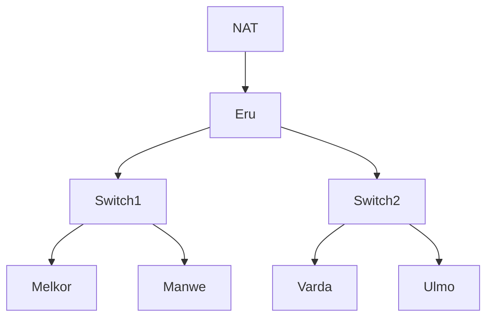

# Komunikasi Data dan Jaringan Komputer &mdash; Modul 1

## Table of Contents

1. [1 Router & 2 Switches & 4 Clients](#1-1-router--2-switches--4-clients)  
2. [Menghubungkan Router ke Internet](#2-menghubungkan-router-ke-internet)  
3. [Menghubungkan tiap Client dengan satu sama lain](#3-menghubungkan-tiap-client-dengan-satu-sama-lain)  
4. [Menghubungkan tiap Client dengan internet](#4-menghubungkan-tiap-client-dengan-internet)  
5. [Membuat Konfigurasi Node tidak hilang ketika Restart](#5-membuat-konfigurasi-node-tidak-hilang-ketika-restart)  
6. [Packet Sniffing Koneksi Manwe dengan Eru](#6-packet-sniffing-koneksi-manwe-dengan-eru)  
7. [FTP Server & 2 New User Permissions](#7-ftp-server--2-new-user-permissions)  
8. [Analisis Proses Upload File & Identifikasi Perintah FTP](#8-analisis-proses-upload-file--identifikasi-perintah-ftp)  
9. [Akses Pengguna FTP](#9-akses-pengguna-ftp)  
   - [9.1 Download File](#91-download-file)  
   - [9.2 Memindahkan File ke Dalam FTP](#92-memindahkan-file-ke-dalam-ftp)  
   - [9.3 Melakukan konfigurasi akses pengguna](#93-melakukan-konfigurasi-akses-pengguna)  
   - [9.4 Uji Akses Pengguna](#94-uji-akses-pengguna)  
10. [Identifikasi Packet Loss & Average Round Trip Time](#10-identifikasi-packet-loss--average-round-trip-time)
     - [10.1 Ping Spam](#101-ping-spam)
     - [10.2 Ping Flood](#102-ping-flood)
11. [Identifikasi Kelemahan Telnet Protokol](#11-identifikasi-kelemahan-telnet-protokol)  
12. [Scan Port Netcat](#12-scan-port-netcat)
    - [12.1 Setup Port](#121-setup-port)
    - [12.2 Netcat](#122-netcat)  
13. [Identifikasi Keunggulan Secure Shell](#13-identifikasi-keunggulan-secure-shell)  
14. [Identifikasi Brute Force](#14-identifikasi-brute-force)
    - [14.1 Jumlah Packets](#141-jumlah-packets)
    - [14.2 User Login (HTTP)](#142-user-login-http)
    - [14.3 Stream ID](#143-stream-id)
    - [14.4 Identifikasi Tools](#144-identifikasi-tools)
15. [Identifikasi Device & Keystrokes](#15-identifikasi-device--keystrokes)  

## 1. 1 Router & 2 Switches & 4 Clients
**Goal:** Menghubungkan 1 Router dengan 2 Switches/Gateways, dimana tiap switch akan terhubung dengan 2 Client
-   **Components:**
    -   Router: Eru
    -   Switch1
    -   Switch2
    -   Client1: Melkor
    -   Client2: Manwe
    -   Client3: Varda
    -   Client4: Ulmo



## 2. Menghubungkan Router ke Internet
**Goal:** Menyambungkan Eru dengan internet.

## 3. Menghubungkan tiap Client dengan satu sama lain
**Goal:** Menghubungkan Melkor, Manwe, Varda, dan Ulmo antara satu sama lain.

## 4. Menghubungkan tiap Client dengan internet
**Goal:** Menyambungkan Melkor, Manwe, Varda, dan Ulmo dengan internet.

## 5. Membuat Konfigurasi Node tidak hilang ketika Restart
**Goal:** Mengkonfigurasi tiap Node (Router dan Client) sehingga ketika di-restart konfigurasi tidak akan terulang.

## 6. Packet Sniffing Koneksi Manwe dengan Eru
**Goal:** Melakukan *packet sniffing* terhadap traffic yang terbuat antara Manwe dengan Eru.

> - **Notes:** Mencantumkan hasil *capture* yang merupakan hasil *packet sniffing* dengan *display filter* untuk menampilkan semua paket yang berasal dari atau menuju ke **IP Address Manwe**.
> - **Artifacts:** [traffic.zip](https://drive.google.com/drive/folders/1ULr_Fik1O0_79zUng41POMZtdzJTugVR?usp=sharing)

## 7. FTP Server & 2 New User Permissions
**Goal:** Membuat suatu FTP Server dengan dua user baru dimana ainur memiliki *write & read permission* dan melkor tidak memiliki permission sama sekali.

> - **Notes:** Melakukan testing dengan file teks sederhana yang diuji dengan diakses oleh kedua user baru.

## 8. Analisis Proses Upload File & Identifikasi Perintah FTP
**Goal:** Menggunakan user *ainur* untuk upload dari *Ulmo* untuk upload file ke *Eru* dan menganalisis proses dan mengidentifikasi perintah FTP yang terjadi menggunakan Wireshark.
> - **Artifacts:** [cuaca.zip](https://drive.google.com/drive/folders/1XQh6S1xXcaP1QoUhQSZORsgK9xdMUxXx?usp=sharing)

## 9. Akses Pengguna FTP
**Goal:** Membagikan file "Kitab Penciptaan" sebagai *Eru* serta memastikan node *Manwe* dapat mengunduh file tersebut dan membatasi akun pengguna *ainur* menjadi *read-only*.

### 9.1 Download File
Langkah pertama sebelum membagikan file "Kitab Penciptaan" melalui **Eru**, kita perlu mengunduh file melalui Google drive. Buka node **Eru** dan jalankan command berikut:
```shell
wget --no-check-certificate 'https://drive.google.com/uc?export=download&id=11ua2KgBu3MnHEIjhBnzqqv2RMEiJsILY' -O kitab_penciptaan.zip
```
Karena file yang di *download* merupakan `.zip`, maka kita perlu mengekstraknya untuk mendapatkan file `.txt`

Instal `unzip` untuk membantu mengekstrak file:
```bash
apt install unzip
unzip kitab_penciptaan.zip
```

### 9.2 Memindahkan File ke Dalam FTP
Setelah selesai mengekstak file, kita perlu memindah file tersebut ke dalam direktori FTP server supaya dapat diakses node lain melalui FTP
```bash
mv kitab_penciptaan.txt /srv/ftp/
```

### 9.3 Melakukan konfigurasi akses pengguna
Karena kita ingin membagikan file ini ke node **Manwe** dengan memastikan bahwa user **ainur** hanya memiliki akses *read-only*, kita perlu menambahkan file konfigurasi akses pengguna.
```bash
echo “user_config_dir=/etc/vsftpd_user_conf” > /etc/vsftpd.conf
mkdir /etc/vsftpd_user_conf
```
Setelah folder konfigurasi pengguna sudah ditambahkan ke konfigurasi umum, kita dapat menambahkan file konfigurasi pengguna ke dalam folder tersebut.

Konfigurasi **Manwe**
```
echo “write_enable=YES” > /etc/vsftpd_user_conf/manwe
```
Konfigurasi **ainur**
```
echo “write_enable=NO” > /etc/vsftpd_user_conf/ainur
```

### 9.4 Uji Akses Pengguna
Pada node **Manwe**, kita seharusnya dapat megunduh, mengunggah, dan menghapus file melalui FTP dengan kredensial
```
Name : manwe
Password: manwe
```
Jalankan perintah FTP dan masukkan kredensial yang telah disediakan.
```
ftp 10.72.1.1
```
Uji akses pengguna dengan mengunduh file dan mengunggah file
```
ftp> get kitab_penciptaan.txt
ftp> put coba.txt
```
Jika konfigurasi sudah benar, maka kedua perintah tersebut akan berhasil dijalankan.

Kemudian, pada node yang sama, kita akan menguji akses pengguna **ainur** dengan kredensial
```
Name: ainur
Password: ainur
```
Lakukan perintah FTP yang sama dengan kredensial **ainur** dan jika konfigurasi sudah benar, maka pengguna **ainur** hanya dapat mengunduh file tetapi tidak dapat mengunggah file dengan respon `550 Permission denied.`

> - **Artifacts:** [cuaca.zip](https://drive.google.com/drive/folders/1XQh6S1xXcaP1QoUhQSZORsgK9xdMUxXx?usp=sharing)

## 10. Identifikasi Packet Loss & Average Round Trip Time
**Goal:** Melakukan spam ping ke node *Eru* menggunakan sebagai *Melkor* dan mengidentifikasi dampak dari ping.

### 10.1 Ping Spam

Kita akan mengirimkan ping dengan jumlah 100 paket ke node **Eru** melalui node **Melkor**
Kita dapat menggunakan command berikut:
```
ping -c 100 10.72.1.1
```
atau
```
ping -f -c 100 10.72.1.1
```
Setelah itu, kita akan mendapatkan detail terkait persentase packet loss dan average round trip time


Di sini kita dapat melihat bahwa dengan membatasi jumlah ping sebanyak 100 paket, dampak yang terjadi pada *average round trip time* dan jumlah persentase *packet loss* tidak begitu signifikan.

### 10.2 Ping Flood

Namun, jika kita menghilangkan batas tersebut. Dampaknya pada *average round trip time* dan jumlah persentase *packet loss* akan sedikit lebih terlihat.


## 11. Identifikasi Kelemahan Telnet Protokol
> **Goal:** Buat akun baru di node *Melkor* dan tangkap sesi login *Eru* menggunakan Wireshark.


## 12. Scan Port Netcat
> **Goal:** Melakukan pemindaian port dari node *Eru* ke node *Melkor* menggunakan **Netcat** `nc` untuk memeriksa port 21, 80 dalam keadaan terbuka dan port 666 dalam keadaan tertutup.

## 12.1 Setup Port
Pada node **Melkor**, jalankan FTP dan apache untuk membuka port 21 dan 80

FTP
```
apt-get install vsftpd -y
service vsftpd start
```

Apache
```
apt-get install apache2 -y
service apache2 start
```

## 12.2 Netcat
Pada node **Eru** lakukan netcat ke IP **Melkor** dengan port yang sudah ditentukan (21, 80, 666)
```
nc -zv 10.72.1.2 21 60 666
```
Jika berhasil, output yang diberikan akan terlihat seperti ini:
```
Connection to 10.72.1.2 21 port [tcp/ftp] succeeded!
Connection to 10.72.1.2 80 port [tcp/http] succeeded!
nc: connect to 10.72.1.2 port 666 (tcp) failed: Connection refused
```

## 13. Identifikasi Keunggulan Secure Shell
**Goal:** Melakukan koneksi SSH dari node *Varda* ke *Eru* dan menganalisis perbedaan `telnet` dengan SSH.

## 14. Identifikasi Brute Force
**Goal:** Mengidentifikasi serangan brute force melalui HTTP request melalui Wireshark.

### 14.1 Jumlah Packets

***Q: How many packets are recorded in the pcapng file?***

Pada tampilan Wireshark di bagian bawah terdapat semacam *footer* yang mencantumkan nama file jumlah *packets* dan profile yang dipakai. Dari tampilan tersebut kita bisa mengetahui jumlah *packets* yang ada pada file yang sedang kita buka.


Dari tampilan ini kita menemukan bahwa terdapat sebanyak `500358` *packets*

### 14.2 User Login (HTTP)

***Q: What are the user that successfully logged in?***

Jika dilihat sekilas, kita tahu bahwa pada file ini terdapat jejak yang menunjukkan beberapa kali percobaan login melalui HTTP request. Kita akan menggunakan filter `http.response.code == 200` untuk mengambil request yang berhasil diproses saja.


Dari hasil filter, kita menemukan respons yang menunjukkan "Invalid credentials" yang berarti request login berhasil diproses. 

Selanjutnya, kita perlu mengeleminasi login yang gagal untuk menemukan respon login yang berhasil. Kita akan menggunakan filter `http contains "Invalid credentials"` dan kemudian menandai seluruh respons gagal login dengan *select all* `ctrl + a` dan *shortcut* `ctrl + m` untuk *mark*. Setelah itu, kita bisa kembali ke filter `http.response.code == 200` dan menemukan respons yang tidak tertandai.


Setelah itu kita bisa klik kanan pada *packet* tersebut dan memilih `follow > HTTP Stream` untuk mendapatkan detail request yang bersangkutan dengan respons tersebut.


Dari tampilan ini kita menemukan kredensial pengguna yang berhasil digunakan untuk login, yaitu:
```
n1enna:y4v4nn4_k3m3nt4r1
```

### 14.3 Stream ID

***Q: In which stream were the credentials found?***

Pada tampilan `HTTP Stream` sebelumnya, kita dapat melihat ID stream pada bagian atas (header).


Tampilan tersebut menunjukkan bahwa kredensial pengguna yang digunakan untuk login ada pada stream `41824`.

### 14.4 Identifikasi Tools

***Q: What tools are used for brute force?***

Karena brute force dilakukan melalui protokol HTTP, maka tools yang digunakan dapat kita lihat pada tampilan `HTTP Stream` yang sama pada bagian `User-Agent` di dalam barisan request.


Melalui tampilan tersebut, kita dapat mengetahui bahwa tools yang digunakan oleh penyerang adalah `Fuzz Faster U Fool v2.1.0-dev`.

> - flag: KOMJAR25{Brut3_F0rc3_GYJfoNyTGpfHDDqiVrB7bXs9G}

## 15. Identifikasi Device & Keystrokes
**Goal:** Mengidentifikasi device yang digunakan penyerang dan melakukan decode pada input keystrokes yang ditemukan
