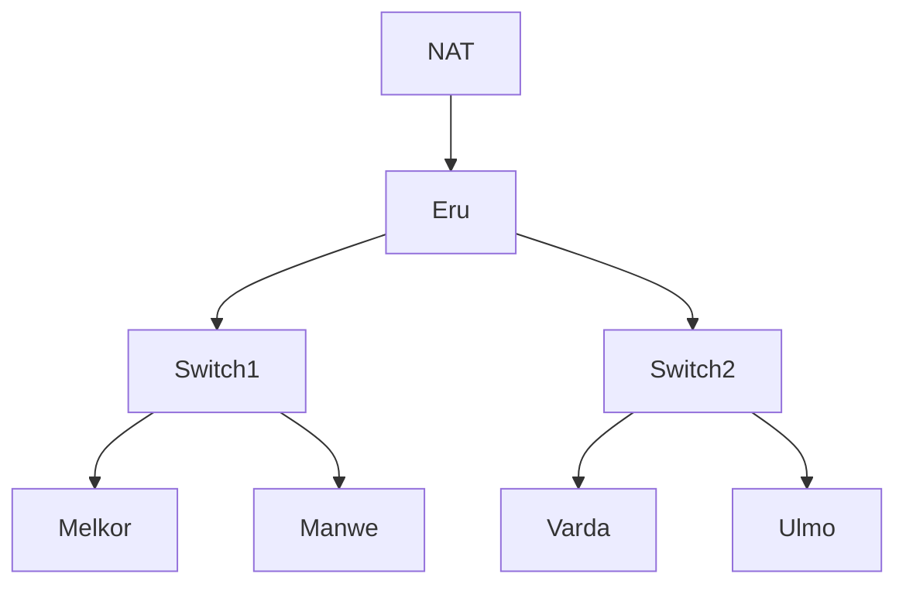

# Komunikasi Data dan Jaringan Komputer &mdash; Modul 1

## Table of Contents


## 1. 1 Router & 2 Switches & 4 Clients
> **Goal:** Menghubungkan 1 Router dengan 2 Switches/Gateways, dimana tiap switch akan terhubung dengan 2 Client
-   **Components:**
    -   Router: Eru
    -   Switch1
    -   Switch2
    -   Client1: Melkor
    -   Client2: Manwe
    -   Client3: Varda
    -   Client4: Ulmo



## 2. Menghubungkan Router ke Internet
> **Goal:** Menyambungkan Eru dengan internet.

## 3. Menghubungkan tiap Client dengan satu sama lain
> **Goal:** Menghubungkan Melkor, Manwe, Varda, dan Ulmo antara satu sama lain.

## 4. Menghubungkan tiap Client dengan internet
> **Goal:** Menyambungkan Melkor, Manwe, Varda, dan Ulmo dengan internet.

## 5. Membuat Konfigurasi Node tidak hilang ketika Restart
> **Goal:** Mengkonfigurasi tiap Node (Router dan Client) sehingga ketika di-restart konfigurasi tidak akan terulang.

## 6. Packet Sniffing Koneksi Manwe dengan Eru
> **Goal:** Melakukan *packet sniffing* terhadap traffic yang terbuat antara Manwe dengan Eru.
- **Notes:** Mencantumkan hasil *capture* yang merupakan hasil *packet sniffing* dengan *display filter* untuk menampilkan semua paket yang berasal dari atau menuju ke **IP Address Manwe**.
- **Artifacts:** [traffic.zip](https://drive.google.com/drive/folders/1ULr_Fik1O0_79zUng41POMZtdzJTugVR?usp=sharing)

## 7. FTP Server & 2 New User Permissions
> **Goal:** Membuat suatu FTP Server dengan dua user baru dimana ainur memiliki *write & read permission* dan melkor tidak memiliki permission sama sekali.
- **Notes:** Melakukan testing dengan file teks sederhana yang diuji dengan diakses oleh kedua user baru.

## 8. Analisis Proses Upload File & Identifikasi Perintah FTP
> **Goal:** Menggunakan user *ainur* untuk upload dari *Ulmo* untuk upload file ke *Eru* dan menganalisis proses dan mengidentifikasi perintah FTP yang terjadi menggunakan Wireshark.
- **Artifacts:** [cuaca.zip](https://drive.google.com/drive/folders/1XQh6S1xXcaP1QoUhQSZORsgK9xdMUxXx?usp=sharing)

## 9. Akses Pengguna FTP
> **Goal:** Membagikan file "Kitab Penciptaan" sebagai *Eru* serta memastikan node *Manwe* dapat mengunduh file tersebut dan membatasi akun pengguna *ainur* menjadi *read-only*.

### 9.1 Download File
Langkah pertama sebelum membagikan file "Kitab Penciptaan" melalui **Eru**, kita perlu mengunduh file melalui Google drive. Buka node **Eru** dan jalankan command berikut:
```shell
wget --no-check-certificate 'https://drive.google.com/uc?export=download&id=11ua2KgBu3MnHEIjhBnzqqv2RMEiJsILY' -O kitab_penciptaan.zip
```
Karena file yang di *download* merupakan `.zip`, maka kita perlu mengekstraknya untuk mendapatkan file `.txt`

Instal `unzip` untuk membantu mengekstrak file:
```bash
apt install unzip
unzip kitab_penciptaan.zip
```

### 9.2 Memindahkan File ke Dalam FTP
Setelah selesai mengekstak file, kita perlu memindah file tersebut ke dalam direktori FTP server supaya dapat diakses node lain melalui FTP
```bash
mv kitab_penciptaan.txt /srv/ftp/
```

### 9.3 Melakukan konfigurasi akses pengguna
Karena kita ingin membagikan file ini ke node **Manwe** dengan memastikan bahwa user **ainur** hanya memiliki akses *read-only*, kita perlu menambahkan file konfigurasi akses pengguna.
```bash
echo “user_config_dir=/etc/vsftpd_user_conf” > /etc/vsftpd.conf
mkdir /etc/vsftpd_user_conf
```
Setelah folder konfigurasi pengguna sudah ditambahkan ke konfigurasi umum, kita dapat menambahkan file konfigurasi pengguna ke dalam folder tersebut.

Konfigurasi **Manwe**
```
echo “write_enable=YES” > /etc/vsftpd_user_conf/manwe
```
Konfigurasi **ainur**
```
echo “write_enable=NO” > /etc/vsftpd_user_conf/ainur
```

### 9.4 Uji Akses Pengguna
Pada node **Manwe**, kita seharusnya dapat megunduh, mengunggah, dan menghapus file melalui FTP dengan kredensial
```
Name : manwe
Password: manwe
```
Jalankan perintah FTP dan masukkan kredensial yang telah disediakan.
```
ftp 10.72.1.1
```
Uji akses pengguna dengan mengunduh file dan mengunggah file
```
ftp> get kitab_penciptaan.txt
ftp> put coba.txt
```
Jika konfigurasi sudah benar, maka kedua perintah tersebut akan berhasil dijalankan.

Kemudian, pada node yang sama, kita akan menguji akses pengguna **ainur** dengan kredensial
```
Name: ainur
Password: ainur
```
Lakukan perintah FTP yang sama dengan kredensial **ainur** dan jika konfigurasi sudah benar, maka pengguna **ainur** hanya dapat mengunduh file tetapi tidak dapat mengunggah file dengan respon `550 Permission denied.`

- **Artifacts:** [cuaca.zip](https://drive.google.com/drive/folders/1XQh6S1xXcaP1QoUhQSZORsgK9xdMUxXx?usp=sharing)

## 10. Identifikasi Packet Loss & Average Round Trip Time
> **Goal:** Melakukan spam ping ke node *Eru* menggunakan sebagai *Melkor* dan mengidentifikasi dampak dari ping.

Kita akan mengirimkan ping dengan jumlah 100 paket ke node **Eru** melalui node **Melkor**
Kita dapat menggunakan command berikut:
```
ping -c 100 10.72.1.1
```
atau
```
ping -f -c 100 10.72.1.1
```
Setelah itu, kita akan mendapatkan detail terkait persentase packet loss dan average round trip time


Di sini kita dapat melihat bahwa dengan membatasi jumlah ping sebanyak 100 paket, dampak yang terjadi pada *average round trip time* dan jumlah persentase *packet loss* tidak begitu signifikan.

Namun, jika kita menghilangkan batas tersebut. Dampaknya pada *average round trip time* dan jumlah persentase *packet loss* akan sedikit lebih terlihat.


## 11. Identifikasi Kelemahan Telnet Protokol
> **Goal:** Buat akun baru di node *Melkor* dan tangkap sesi login *Eru* menggunakan Wireshark.


## 12. Scan Port Netcat
> **Goal:** Melakukan pemindaian port dari node *Eru* ke node *Melkor* menggunakan **Netcat** `nc` untuk memeriksa port 21, 80 dalam keadaan terbuka dan port 666 dalam keadaan tertutup.

## 13. Identifikasi Keunggulan Secure Shell
> **Goal:** Melakukan koneksi SSH dari node *Varda* ke *Eru* dan menganalisis perbedaan `telnet` dengan SSH.

## 14. Identifikasi Brute Force
> **Goal:** Mengidentifikasi serangan brute force melalui HTTP request melalui Wireshark.

## 15. Identifikasi Device & Keystrokes
> **Goal:** Mengidentifikasi device yang digunakan penyerang dan melakukan decode pada input keystrokes yang ditemukan
