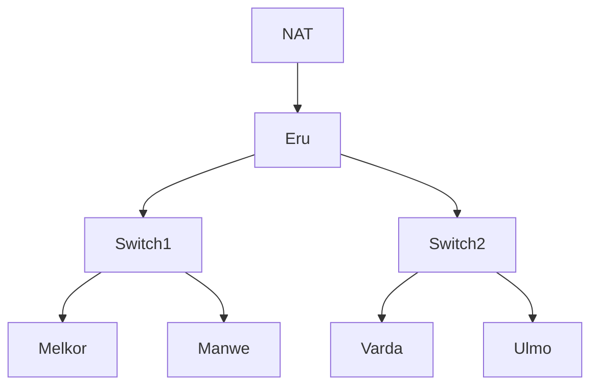

# Komunikasi Data dan Jaringan Komputer &mdash; Modul 1

## Table of Contents

## Soal

### 1. 1 Router & 2 Switches & 4 Clients

-   **Goal:** Menghubungkan 1 Router dengan 2 Switches/Gateways, dimana tiap switch akan terhubung dengan 2 Client
-   **Components:**
    -   Router: Eru
    -   Switch1
    -   Switch2
    -   Client1: Melkor
    -   Client2: Manwe
    -   Client3: Varda
    -   Client4: Ulmo

### 2. Menghubungkan Router ke Internet

- **Goal:** Menyambungkan Eru dengan internet.

### 3. Menghubungkan tiap Client dengan satu sama lain

- **Goal:** Menghubungkan Melkor, Manwe, Varda, dan Ulmo antara satu sama lain.

### 4. Menghubungkan tiap Client dengan internet

- **Goal:** Menyambungkan Melkor, Manwe, Varda, dan Ulmo dengan internet.

### 5. Membuat Konfigurasi Node tidak hilang ketika Restart

- **Goal:** Mengkonfigurasi tiap Node (Router dan Client) sehingga ketika di-restart konfigurasi tidak akan terulang.

### 6. Packet Sniffing Koneksi Manwe dengan Eru

- **Goal:** Melakukan *packet sniffing* terhadap traffic yang terbuat antara Manwe dengan Eru.
- **Notes:** Mencantumkan hasil *capture* yang merupakan hasil *packet sniffing* dengan *display filter* untuk menampilkan semua paket yang berasal dari atau menuju ke **IP Address Manwe**.
- **Artifacts:** [traffic.zip](https://drive.google.com/drive/folders/1ULr_Fik1O0_79zUng41POMZtdzJTugVR?usp=sharing)

### 7. FTP Server & 2 New User Permissions

- **Goal:** Membuat suatu FTP Server dengan dua user baru dimana ainur memiliki *write & read permission* dan melkor tidak memiliki permission sama sekali.
- **Notes:** Melakukan testing dengan file teks sederhana yang diuji dengan diakses oleh kedua user baru.

### 8. Analisis proses upload file & identifikasi perintah FTP

- **Goal:** Menggunakan user *ainur* untuk upload dari *Ulmo* untuk upload file ke *Eru* dan menganalisis proses dan mengidentifikasi perintah FTP yang terjadi menggunakan Wireshark.
- **Artifacts:** [cuaca.zip](https://drive.google.com/drive/folders/1XQh6S1xXcaP1QoUhQSZORsgK9xdMUxXx?usp=sharing)

## Pembahasan
